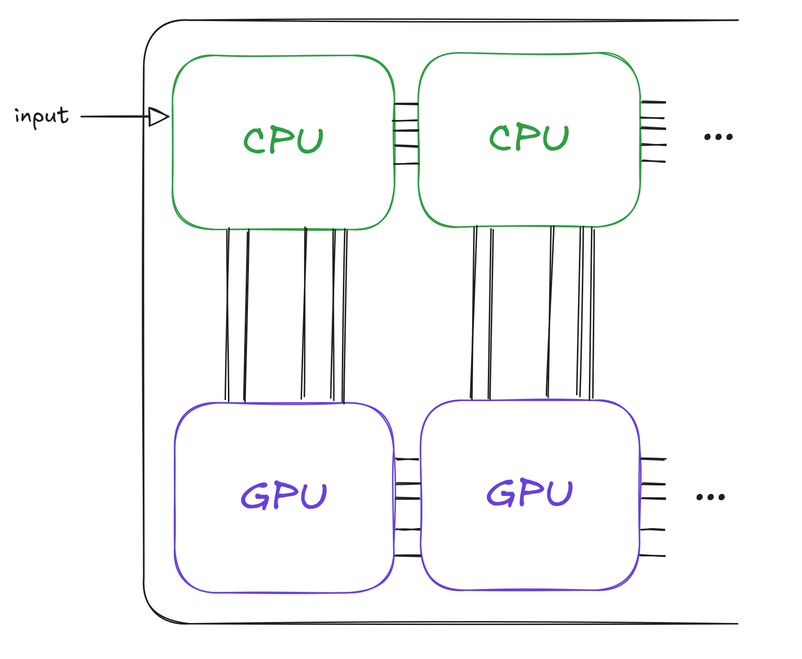
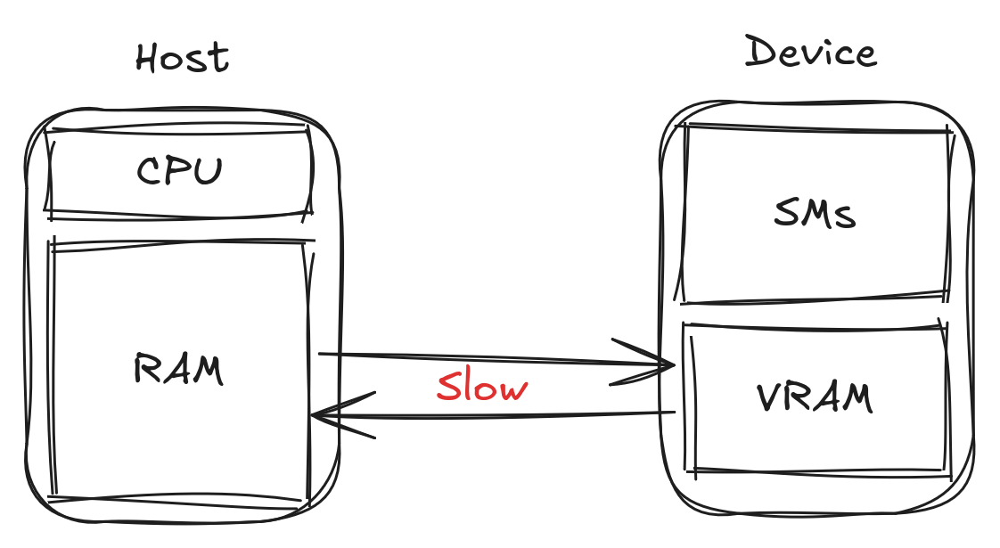
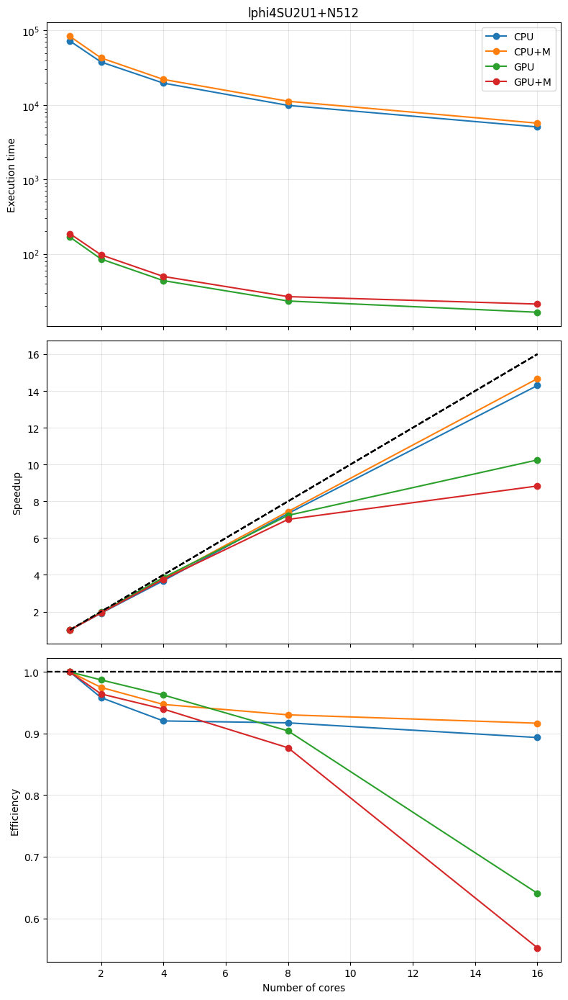

There is clearly a vast number of physical scenarios that can be implemented in CosmoLattice, and in order to optimize the ''physics output" from many different scenarios, we have made available a number of powerful technical features in the code. Most of these features are provided by [`TempLat`](https://github.com/cosmolattice/templat), the lattice library that forms the backbone of CosmoLattice. 

The most relevant one is the possibility of directly running any model written in CosmoLattice on a wide range of different (parallel) hardware. 
This means that CosmoLattice runs natively, without any modification whatsoever of the code, on any number of CPU cores or GPUs, either within a single PC, or on many nodes in a HPC cluster. 

As we will shortly show, all it takes for the user to run their model in any of these scenarios, are a few simple flags passed to the `CMake`. 
Before explaining this, we give in Section [*Concepts*][subsec_para] a brief explanation how parallelization is handled in CosmoLattice. We also explain the distinction between *distributed* and *shared* parallelism, and what happens technically at the computation level.

Any user not interested in these technical details may want to skip directly to Sections [*Distributed parallelization in one direction: MPI*][subsubsec_para1D], [*Distributed parallelization in multiple directions: MPI and ParaFaFT*][subsubsec_para2D] and [*Shared-memory parallelization and GPUs*][subsubsec_devices], where we simply explain how they can activate the various parallelization options in CosmoLattice.

### Concepts { #subsec_para }

As we increase the size of our lattice simulations, we quickly encounter computational limitations. 
These are of two types: 
1. We are limited by the real duration (as counted by hours/days/etc by ourselves) necessary to run a given simulation. Doubling the number of points $N$ per dimension increases the execution time roughly by a factor $\sim 2^d$, with $d$ the number of dimensions. In other words, the execution time scales with the volume of the lattice. 
2. The memory (RAM) needed to perform the simulation also scales with the volume, i.e. doubling $N$ increases the required RAM also by a factor $2^d$. Oftentimes, memory presents a more severe limitation than execution time, as longer execution times may be compensated by more patience (at least to some extent), while the limit on memory is hardware-bound.

Both of these hindrances can be mitigated by a simple idea: instead of running the whole simulation as a singular sequential process, we split both *computation* and *data* across many cores, which can work simultaneously. This is what we mean by parallelization. There are two complementary ways to do this, and CosmoLattice utilizes both in a hybrid manner:

- **Distributed** parallelization splits the simulation across separate *nodes* (think of them as independent computers), each with its own private memory. Both the data and the computation are divided between the nodes, which then exchange information over a network. This is what gives access to more memory: with $n_p$ nodes you can run a problem roughly $n_p$ times larger than would fit on a single machine. The standard tool for this is the *Message Passing Interface* (`MPI`).
- **Shared-memory** parallelization splits only the computation across many *threads* that all see the same memory. This is the model used by the multiple cores of a single CPU, and, in the extreme, by the thousands of threads of a **GPU**. Here, all threads share one address space, so there is no large-scale data exchange, but the total memory is limited to that of the hardware of the single node or device.

<div style="display: flex; align-items: center; gap: 1.5rem; flex-wrap: wrap;" markdown>
<div style="flex: 1 1 300px;" markdown>
The hardware hierarchy is sketched in Fig. [*1*][fig_hardware]: a cluster is made of many nodes connected by a network (the domain of distributed parallelism), while inside each node a CPU offers a handful of shared-memory cores and an attached GPU offers thousands more. The two strategies compose: one typically distributes a large problem across nodes with `MPI` and, within each node, uses shared-memory parallelism on the CPU cores or the GPU.

In the distributed case, most of the problems suitable for lattice simulations involve some spatial derivatives or some kind of finite range interaction. The clearest example is any kind of kinetic term for scalar or gauge fields, which couples neighboring sites of the lattice.
</div>
<div style="flex: 0 1 400px;" markdown>
[](){ #fig_hardware }
<figure markdown="span">
    { width=400px}
</figure>
</div>
</div>

As a result, to evolve the system correctly over the entire lattice, divided into $n_p$ sub-lattices, it is not enough to evolve the system separately on each sub-lattice. Rather, at every time step, the sub-lattices need to exchange information on the values of the fields at their boundaries, so that the interaction between neighboring sites across the boundaries can be correctly taken into account. Note that TempLat supports also interactions that require more than nearest neighbors, so the exchange of information may involve more than one layer of boundary sites.

We clarify this in Fig. [*2*][fig_1d], where we consider the one-dimensional case and explain the case with two cores. The physical lattice $\Lambda$ consist of the field values $\phi_0$ to $\phi_7$. To perform the computation, we can subdivide it into two smaller lattices $\Lambda_1$ and $\Lambda_2$. $\Lambda_1$ owns the field values $\phi_0$ to $\phi_3$ and we assign it to the first process. 
$\Lambda_2$ owns $\phi_4$ to $\phi_7$ and we assign it to the second process. 
Now imagine that, in order to solve our system of equations, we need to compute a gradient, which we write as a forward derivative [recall Eq. ([*18*][eq_forwardbackwardd])]. 
When our first process tries to evaluate it at site $3$, it needs to compute $\frac{\phi_4-\phi_3}{\delta x}$, i.e. it requires the value of $\phi_4$, which belongs, however, to the other process.

To solve this problem, we introduce *ghost cells*. 
Each of the sub-lattices is extended with extra sites at the boundaries (*ghost cells*). 
These ghost cells are not evolved, but they are copied from the inside of the neighboring sub-lattices after every time step. Thus, they always mirror the current values of the fields as evolved by the respective owning sub-lattice. 
In this way, the boundary values are always available to all neighboring sub-lattices, and the computation can proceed without interruption.

Very explicitly, in our one-dimensional example of Fig. [*2*][fig_1d], we add an extra site (the ghost cell) to $\Lambda_1$ containing $\phi_4$, and an extra site to $\Lambda_2$ containing $\phi_3$. Whenever $\phi_3$ is modified in $\Lambda_1$, it needs to be communicated to $\Lambda_2$, and whenever $\phi_4$ is modified in $\Lambda_2$, it needs to be communicated to $\Lambda_1$. Of course, since we use periodic boundary conditions, the same technique can be used for the boundaries $\phi_0$ and $\phi_7$.

In higher spatial dimensions, the geometry of the boundaries to be exchanged might become more complicated, but the intrinsic idea remains the same. 
This is the distributed parallelization idea implemented in CosmoLattice, based on the use of `MPI`, a standard library to program the boundary exchanges. We discuss in the next sections two distributed strategies (parallelizing in one direction, or in multiple directions), before turning to shared-memory and GPU parallelism, and explain how the user can choose between them when using CosmoLattice.

[](){ #fig_1d }
<figure markdown="span">
    { width=750px}
</figure>


### Distributed parallelization in one direction: `MPI` { #subsubsec_para1D }

As briefly discussed in the previous section, the parallelization of ''local" operations, like solving finite difference systems, is relatively straightforward: it only requires exchanging ghost cells at the boundaries between neighboring sub-lattices. With `MPI` alone, CosmoLattice splits the lattice along a single spatial direction, leading to the decomposition presented in the left-hand side of Fig. [*3*][fig_parageo]. This is enough for the local part of the evolution, but typical simulations performed through the `CosmoInterface` also require ''non-local" operations, namely Fourier transforms, in order to e.g. set the initial fluctuations of the fields, or compute their spectra. When parallelizing in a single direction, these can be handled by the standard `fftw3` library, whose distributed transforms work along one direction. Note that in the current implementation of CosmoLattice, the linear size $N$ of the lattice must be an integer multiple of the number of cores you want to use. For instance, in Fig. [*3*][fig_parageo], as we want to use three cores, $N$ must be a multiple of three.

[](){ #fig_parageo }
<figure markdown="span">
    { width=750px}
</figure>

It is very easy to activate this parallelization procedure in CosmoLattice. Assuming you have installed `MPI` and a properly compiled version of `fftw3` (see Appendix [Installation](Installation.md) for more information, installation instructions for these libraries and guidance to use them on HPC clusters), you simply need to pass an extra flag `-DMPI=ON` to `CMake` before compiling your model:
```bash
cmake -DMPI=ON -DMODEL=lphi4 ../
make cosmolattice
```
Of course, if you want to compile any other model (including the ones with gauge fields), you simply need to replace `lphi4` by the name of your model, as explained in Sections [My first model of (singlet) scalar fields](My first model of (singlet) scalar fields.md) and [My first model of gauge fields](My first model of gauge fields.md).

After having successfully compiled CosmoLattice, you can run it with `nc` cores with `nc$\geq 1$. Of course you need to have access to such number of CPU's; a typical laptop will have between one and four, whereas you can use even thousands of cores on a HPC cluster. This is done as follows,
```bash
mpirun -n nc lphi4 input=...
```
Note that if you are using a high-performance-computation (HPC) cluster, you will typically have to use another command to run your parallel jobs.

### Distributed parallelization in multiple directions: `MPI` and `ParaFaFT` { #subsubsec_para2D }

Parallelizing only in one direction limits the maximum number of cores to $N$, the linear size of the lattice. To go further, we need to be able to compute Fourier transforms that are themselves distributed across more than one direction. CosmoLattice does this through the `ParaFaFT` library, a modern, header-only implementation of distributed multidimensional FFTs based on the algorithm of Dalcin, Mortensen & Keyes [@Dalcin_2019], which replaces the parallel-FFT library used in earlier versions of CosmoLattice. `ParaFaFT` distributes the transform over a *pencil* decomposition built with advanced `MPI` collective operations, and provides `fftw3` (CPU), `cuFFT` (NVIDIA) and `hipFFT` (AMD) backends.

This in principle allows us to parallelize the simulation in all directions. In practice, because of the overload due to the boundary exchanges, it is often a good compromise to parallelize in all dimensions except one, which involves less cores, but also less boundaries. We depict the resulting parallelization strategy for the case of three spatial dimensions in the right-hand side of Fig. [*3*][fig_parageo]. In this case, the number of sites/dimension $N$ of the lattice needs to be divisible by the number of cores used in each parallelized direction. In practice,
when all directions have the same number of points, `N` needs to be an integer multiple of the number of cores.

To switch to this parallelization setting, again assuming you have a working installation of `MPI` and `fftw3` (see Appendix [Installation](Installation.md)), you simply need to pass the extra flag `-DPARAFAFT=ON` to `CMake`, before compiling your favorite model
```bash
cmake -DMPI=ON -DPARAFAFT=ON -DMODEL=lphi4 ../
make cosmolattice
```
Note that this flag must be used together with the `-DMPI=ON` flag.

Nothing changes in this case to execute a run, as you can send a job again using the command:
```bash
mpirun -n nproc lphi4 input=...
```
(or whichever is the equivalent command needed in your HPC cluster).

### Shared-memory parallelization and GPUs { #subsubsec_devices }

The distributed strategies above split the lattice across nodes. Within a single node, CosmoLattice can additionally exploit shared-memory parallelism, either on the many cores of a CPU or, much more aggressively, on a GPU. Lattice field theory is exceptionally well suited to this: at every time step each lattice site is updated essentially independently from the others, so the natural limit on the number of parallel threads is simply the number of lattice sites, which is enormous.

This is precisely what GPUs are built for. Where a CPU offers $\mathcal{O}(10$–$100)$ cores running at a high clock speed (~3 GHz) with a deep memory cache, a GPU offers $\mathcal{O}(10^4)$ cores at a more moderate clock speed (~1.5 GHz) with a much smaller cache — for instance an NVIDIA H100 has around $15000$ cores, and even a laptop-class card has several thousand. A CPU is therefore *thread-constrained* (few but powerful cores) while a GPU is *memory-constrained* (many lightweight cores), as illustrated in Fig. [*4*][fig_gpuarch] (figure source: [NVIDIA](https://www.nvidia.com)). For the site-local updates that dominate a CosmoLattice run, the GPU's massive parallelism — well over $10^5$ simultaneous operations — wins handily.

[](){ #fig_gpuarch }
<figure markdown="span">
    { width=500px}
</figure>

To run the same model code unchanged on either a CPU or a GPU, CosmoLattice relies on the *device* model of its underlying template library, `TempLat`. The idea, sketched in Fig. [*5*][fig_device], is to separate the *sequential* work that runs on the **host** (constructing the symbolic field expressions, program flow, and dispatching work) from the *parallel*, grid-based work that runs on the **device** (the time evolution, the measurements, and the memory reordering). All device work is expressed through a small, hardware-agnostic interface (`device::iteration::reduce`, `device::memory::copyHostToDevice`, and so on). This interface is implemented by a *backend* — currently [Kokkos](https://kokkos.org) — which in turn maps onto the actual hardware: **NVIDIA** GPUs via `CUDA`, **AMD** GPUs via `ROCm`/`HIP`, and shared-memory CPUs via `OpenMP` or C++ threads. Because the model is written against the abstract device interface, exactly the same model code runs on all of these targets.

[](){ #fig_device }
<figure markdown="span">
    { width=400px}
</figure>

In practice this requires no extra work from the user: by default CMake auto-detects the available backend, checking for GPUs first (`CUDA`, then `HIP`) and falling back to CPU threading (`OpenMP`, then C++ threads) and finally to serial execution. You can override the choice explicitly, for instance to force a CPU build or to select a particular GPU vendor:
```bash
cmake -DCUDA=ON -DMODEL=lphi4 ../   # NVIDIA GPU
cmake -DHIP=ON  -DMODEL=lphi4 ../   # AMD GPU
cmake -DOPENMP=ON -DMODEL=lphi4 ../ # multi-core CPU
make cosmolattice
```
The full list of device flags is documented in Appendix [CMake flags](Appendix_CMake_Flags.md). When a GPU backend is enabled, single-node GPU Fourier transforms are handled automatically by `KokkosFFT` (the `-DKOKKOSFFT` flag is switched on for you). A single-GPU run is launched directly, like any serial executable:
```bash
./lphi4 input=...
```
The device model and the distributed `MPI`/`ParaFaFT` strategies compose: to run across **multiple GPUs or multiple nodes**, combine a GPU backend with `-DMPI=ON -DPARAFAFT=ON` (whose `cuFFT`/`hipFFT` backends keep the FFT on the device) and launch the job with `mpirun` as above.

### Performance { #performance }

Before explaining some of the other features of the code, we want to give an idea of how CosmoLattice performs as a parallel code. Be aware that this kind of study has to be considered with care, as the quantitative results depend strongly on the type of hardware used, the compiler, and the `MPI` implementation; the numbers below are illustrative rather than definitive.

[](){ #fig_speedup }
<figure markdown="span">
    { width=750px}
</figure>

Fig. [*6*][fig_speedup] compares the runtime of the `lphi4SU2U1` model on 1-8 GPUs (`CUDA` backend) against 1-8 CPU nodes (using hybrid `OpenMP` and `MPI`) for fixed $N=512$. 

CosmoLattice is also mostly parallel code, with very little sequential work. Following Amdahl's law [@conf_afips_Amdahl67], if a fraction $\alpha$ of the code runs in parallel, the speed-up on $n_{cores}$ cores is
```math
S=\frac{1}{\frac{\alpha}{n_{cores}} +1-\alpha}  .
```
Fitting CosmoLattice's scaling gives $\alpha\approx 0.99$, i.e. effectively $99\%$ of the code is parallelized, so the parallel strategies continue to scale well up to large core counts. We expect this figure to be even better in realistic simulations, where the relatively poorly-scaling field initialization (dominated by Fourier transforms) becomes increasingly subdominant with respect to the field evolution.
