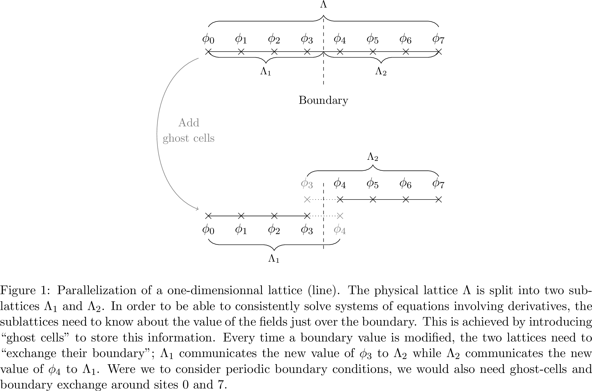
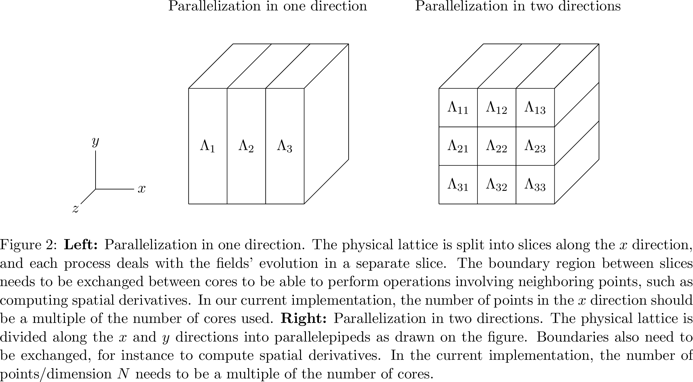
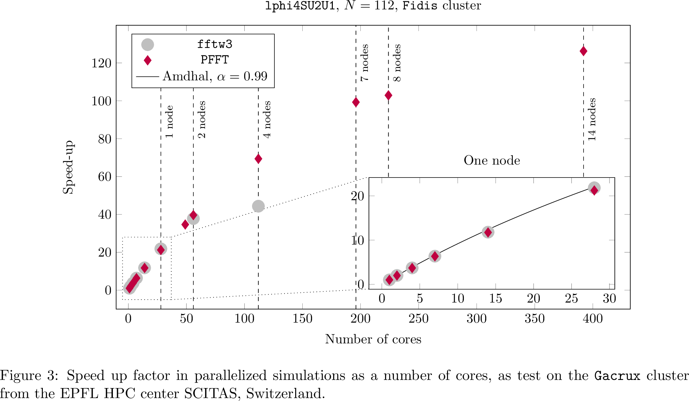

There is clearly a vast number of physical scenarios that can be implemented in CosmoLattice, and in order to optimize the ''physics output" from many different scenarios, we have made available a number of powerful technical features in the code. The most relevant one is the possibility of directly running any model written in CosmoLattice with multiple processors in parallel, without any modification whatsoever of the code. As we will shortly show, all it takes for the user to run their model on potentially hundreds or even thousands of processors, is a simple flag passed to the `CMake`. Before explaining this, we give in Section [*Parallelization*][subsec_para] a brief explanation about what parallelization means, as well as describe what happens technically at the computation level. Any user not interested in these technical details may want to skip directly to Sections [*Parallelization in one direction: MPI*][subsubsec_para1D] and [*Parallelization in two directions: MPI and PFFT*][subsubsec_para2D], where we simply explain how they can activate the parallelization option in CosmoLattice.

Another useful feature provided by CosmoLattice is the possibility of saving up and restarting simulations, as well as the possibility of having an automatic backup every given number of iterations. This feature can also be enabled through a `CMake` flag; we elaborate about it in Section [*Saving three-dimensional field distributions, backups and other options: HDF5*][subsec_hdf5spec]. Using the same external library (`HDF5`), we also provide the user with the possibility of saving spectra in `HDF5` format, which has the advantage of being more structured than the default text files. We explain this also in Section [*Saving three-dimensional field distributions, backups and other options: HDF5*][subsec_hdf5spec].

### Parallelization { #subsec_para }

As we increase the size of our lattice simulations, we quickly encounter computational limitations. These are of two types. First, we are limited by the real duration (as counted by hours/days/etc by ourselves) that it takes to run a given simulation. Every time the number of points/dimension $N$ of a lattice is doubled, the execution time increases roughly by a factor $\sim 2^d$, with $d$ the number of dimensions. That is, the execution time scales with the volume of the lattice. Secondly, the memory (RAM) needed to perform the simulation also scales with the volume, as every time $N$ is doubled, the amount of required RAM memory increases by a factor $8$. Lack of memory is often a more severe limitation than the execution time, as longer execution times may be compensated by more patience (at least to some extent), while the limit on memory can not.

Both of these hindrances can be sharply mitigated by a simple idea: the use of more than one computer to perform the simulations. This is what we mean by parallelization. In spirit, it works as follows: given $n_c$ ''computers" (or ''cores", as we will refer to them), you can split your lattice into $n_p$ smaller sub-lattices. Then, instead of evolving the whole lattice on a single process, you can evolve the $n_p$ smaller sub-lattices on one or several of your $n_c$ cores, and then combine their results whenever needed. In theory, this would speed up your simulation by a factor $n_p$, and give you access to $n_p$ times more memory.

Of course, most of the problems suitable for lattice simulations involve some spatial derivatives or some kind of finite range interaction, and as a result,
the system evolved over the original lattice is not equivalent to the $n_p$ systems over smaller lattices. In the case of systems of equations which involve an interaction between neighboring sites\footnote{Of course, the idea presented here also works and is practical for interactions between sites that are a few sites apart.}, in order to be able to solve the system over the whole original lattice but splitting the evolution over the smaller lattices, it is enough for every sub-lattice to be aware of the values of the fields in the sites of its neighboring lattices, those directly adjacent to their own sides. This is clarified in Fig. [*1*][fig_1d], where we consider the one-dimensional case and explain the case with two cores. The physical lattice $\Lambda$ consist of the field values $\phi_0$ to $\phi_7$. To perform the computation, we can subdivide it into two smaller lattices $\Lambda_1$ and $\Lambda_2$. The first one, which contains the field values $\phi_0$ to $\phi_3$, is assigned to the first process. The second, containing the values $\phi_4$ to $\phi_7$, is assigned to the second process. Now imagine that, in order to solve our system of equations, we need to compute a gradient, which we write as a forward derivative [recall Eq. ([*18*][eq_forwardbackwardd])]. When our first process tries to evaluate it around site $3$, it needs to compute $\frac{\phi_4-\phi_3}{\delta x}$, i.e. it requires the information on the value of $\phi_4$, which belongs however to the adjacent sub-lattice.

To solve this problem, we introduce *ghost cells*. When two sub-lattices have a common boundary, the boundary values are stored in both sub-lattices, and whenever they are modified, the new values are communicated to their neighboring sub-lattice; boundaries are ''exchanged". Very explicitly, in our one-dimensional example of Fig. [*1*][fig_1d], we can add an extra site (the ghost cell) to $\Lambda_1$ containing $\phi_4$, and an extra site to $\Lambda_2$ containing $\phi_3$. Whenever $\phi_3$ is modified in $\Lambda_1$, it needs to be communicated to $\Lambda_2$, and whenever $\phi_4$ is modified in $\Lambda_2$, it needs to be communicated to $\Lambda_1$. Of course, since we use periodic boundary conditions, the same needs are in place with respect the boundaries $\phi_0$ and $\phi_7$.

In higher spatial dimensions, the geometry of the boundaries to be exchanged might become more complicated, but the intrinsic idea remains the same. This is the parallelization idea implemented in CosmoLattice, based on the use of the *Message Passing Interface* (`MPI`), a standard library to program the boundary exchanges. We discuss in the next sections two different parallelization strategies, and how the user can choose between one or another when using CosmoLattice.


[](){ #fig_1d }
<figure markdown="span">
    { width=750px}
</figure>


#### Parallelization in one direction: `MPI` { #subsubsec_para1D }

As briefly discussed in the previous section, the parallelization of ''local" operations, like solving finite difference systems,  is relatively straightforward. However, this is not the case for ''non-local" operations such as Fourier transforms. Typical simulations performed through the `CosmoInterface` require Fourier transforms, in order to e.g. setting the initial fluctuations of the fields, or computing their spectra. CosmoLattice relies on the standard `fftw3` library to perform Fourier transforms. In its current version, this library does allow to parallelize multi-dimensional Fourier transforms, but only along a single direction. As a result, if one is not willing to use any extra library besides `fftw3`, the parallelization of a lattice simulations can only be done along one spatial direction. This leads to the decomposition presented in the left-hand side of Fig. [*2*][fig_parageo]. Note that in the current implementation of CosmoLattice, the linear size $N$ of the lattice must be an integer multiple of the number of cores you want to use. For instance, in Fig. [*2*][fig_parageo], as we want to use three cores, $N$ must be a multiple of three.

[](){ #fig_parageo }
<figure markdown="span">
    { width=750px}
</figure>

It is very easy to activate this parallelization procedure in CosmoLattice. Assuming you have installed `MPI` and a properly compiled version of `fftw3` (see Appendix [Installation](Installation.md) for more information, installation instructions for these libraries and guidance to use them on HPC clusters), you simply need to pass an extra flag `-DMPI=ON` to `CMake` before compiling your model:
```bash
cmake -DMPI=ON -DMODEL=lphi4 ../
make cosmolattice
```
Of course, if you want to compile any other model (including the ones with gauge fields), you simply need to replace `lphi4` by the name of your model, as explained in Sections [My first model of (singlet) scalar fields](My first model of (singlet) scalar fields.md) and [My first model of gauge fields](My first model of gauge fields.md).

After having successfully compiled CosmoLattice, you can run it with `nc` cores with `nc$\geq 1$. Of course you need to have access to such number of CPU's; a typical laptop will have between one and four, whereas you can use even thousands of cores on a HPC cluster. This is done as follows,
```bash
mpirun -n nc lphi4 input=...
```
Note that if you are using a high-performance-computation (HPC) cluster, you will typically have to use another command to run your parallel jobs.

#### Parallelization in two directions: `MPI` and `PFFT` { #subsubsec_para2D }

If we are willing to use some extra external libraries to compute Fourier transforms, we can actually overcome the limitation of `fftw3` and use a parallelization across multiple spatial directions. In the current implementation of CosmoLattice, we use the `PFFT` library [@Pi13], see again Appendix [Installation](Installation.md) for installation instructions. This in principle allows us to parallelize the simulation in all directions. In practice, because of the overload due to the boundary exchanges, it is often a good compromise to parallelize in all dimensions except one, which involves less cores, but also less boundaries. We depict the resulting parallelization strategy for the case of three spatial dimensions in the right-hand side of Fig. [*2*][fig_parageo]. In this case, the number of sites/dimension $N$ of the lattice needs to be divisible by the number of cores used in each parallelized direction. In practice,
when all directions have the same number of points, `N` needs to be an integer multiple of the number of cores.

To switch to this parallelization setting, again assuming you have a working installation of `MPI`, `fftw3` and now `PFFT` (see Apendix [Installation](Installation.md)), you simply need to pass the extra flag `-DPFFT=ON` to `CMake`, before compiling your favorite model
```bash
cmake -DMPI=ON -DPFFT=ON -DMODEL=lphi4 ../
make cosmolattice
```
Note that this flag must be used together with the `-DMPI=ON` flag.

Nothing changes in this case to execute a run, as you can send a job again using the command:
```bash
mpirun -n nproc lphi4 input=...
```
(or whichever is the equivalent command needed in your HPC cluster).

#### Performances

Before explaining some of the other features of the code, we want to show how good CosmoLattice can do as a parallel code. As an example, we will study how the execution time of the `lphi4SU2U1` model scales as a function of the used number of cores. Be aware that this kind of study has to be considered with care, as the quantitative results may depend on the type of hardware used, the actual state of the cluster when performed, the compiler, or the `MPI` implementation. Having noted this, we will show that the CosmoLattice parallelization performs very well, and that the possibility of having a Fourier transform in more than one dimension provides a significant advantage when a large number of cores are required, let it be because of memory or execution time requirements.

[](){ #fig_speedup }
<figure markdown="span">
    { width=750px}
</figure>

For simplicity, we choose a relatively small lattice with $N=112$ points/dimension, which we ran for $250$ time iterations. We perform $25$ ''frequent" measurements (mean values) and $6$ ''infrequent" measurements (spectra). We performed this benchmark on the `Gacrux` cluster\footnote{One node is made of two Intel Broadwell processors running at $2.6$ GHz, with $14$ cores each (hence $28$ codes/node). As node connectivity, it uses Infiniband EDR.} from the
\'Ecole polytechnique f\'ed\'erale de Lausanne (EPFL) HPC center SCITAS. We show the results in Fig. [*3*][fig_speedup], where we plot the speed-up of the program as a function of the number of cores. In particular, we show the speed-up factor $S$, which is defined as the execution time in one core $T_1$ divided by the execution time in $n$ cores $T_n$, i.e. $S \equiv T_1/T_n$. It is important to remark that our test case gives too much importance to the initialization of the fields relative to their evolution ($250$ time steps is orders of magnitude smaller than in a realistic simulation). The initialization functions are dominated by Fourier transforms, which are not expected to scale as good as the evolution routines. In any case, we obtain very satisfying speed-ups. Perhaps the most interesting feature of this figure is the comparison between the one-direction parallelization strategy via `fftw3` and the two-directions parallelization strategy via `PFFT`. It appears that up $\frac{N}{\# cores}\gtrsim 2$, both strategies perform equally well. The maximum number of cores we can have with the first strategy is $\# cores = N$. In this case, we already see it being outperformed by the second strategy. But more importantly, it increases the maximum number of cores we can use. For instance, in Fig. [*3*][fig_speedup] we show our benchmark running on up to $392$ cores with good performances.

To conclude this benchmark, we can attempt to make a more quantitative description of the goodness of the performance of CosmoLattice, restricting our attention to the results obtained on one node; the one obtained on more nodes is harder to analyze as they can be relatively sensitive to hardware-dependent performance fluctuations. They are also sensitive to the efficiency of inter-nodes communications, which require some modeling beyond the scope of this section.

If we want to quantify how much of our code is actually parallelized, we can use a relation referred to as Amdhal's law [@conf_afips_Amdahl67]. Assume $\alpha\%$ of your code is parallelized. The execution time $T_1$ on a single core can then be written as $T_1=\alpha T_1 + (1-\alpha) T_1$. On $n_{cores}$ cores, it becomes $T_{n}=\left(\frac{\alpha}{n_{cores}} +1-\alpha\right)T_1$. Amdhal's law is the prediction of the speed-up you get from this relation,
```math
S=\frac{1}{\frac{\alpha}{n_{cores}} +1-\alpha}  .
```

By fitting our data on one node, we obtain $\alpha\approx 0.99$, which means that effectively $99\%$ of CosmoLattice is parallelized. Note that in actual simulations, we expect this number to be even better, as the invested amount of time in the fields' initialization will be even more subdominant with respect to their evolution. Note also that we performed this benchmark with the full matter content available to CosmoLattice lattice. We expect similar results for the scalar sector alone.

### Saving three-dimensional field distributions, backups and other options: `HDF5` { #subsec_hdf5spec }

When running long simulations, it may come very handy to be able to stop them and restart them later on, or to have some kind of automatic backup in case some problem happens to the hardware you are using. In order to implement this type of features, we need to be able to save the field distributions to a file. For the sake of portability, the current version of CosmoLattice uses the `HDF5` library to perform this task in a binary format. This means that, if you want to use one of the features that involve saving a three-dimensional distribution of some fields to a file, you will need to have a working `HDF5` library installed (see Appendix [Installation](Installation.md) on how to do this). Assuming you have such installation, activating these features in CosmoLattice is as simple as using another `CMake` flag:
```bash
cmake -DHDF5=ON -DMODEL=lphi4 ../
make cosmolattice
```
We will now survey what features this unlocks.

#### Saving a simulation to disk
After having activated `HDF5`, we can now save runs to disk. This is simply done via the argument `save_dir`, which you can add to your input file, or simply pass it through the command line. For instance,
```bash
./lphi4 input=input.in save_dir=./
```
will save this `lphi4` run at the end in the current folder. It is going to create a file named `lphi4_DATE_d**_m**_y**_TIME_h**_m**_s**.h5`, where `lphi4` is the model name, and the $**$ symbols will be replaced by the actual date and time.

You do not need to know anything about the actual content of the file in order to restart your simulation from there. However, thanks to the standardized `HDF5` format, you can easily go and explore the content of the file with your favorite data visualization tool, be it `gnuplot`, `Mathematica`, `Matlab`, `python`, `Julia` or other, as long as it supports `HDF5`. To simplify, a `HDF5` file mimics a folder/file structure, folders being designated as ''groups" and files as ''datasets". In this case, every field is stored in a separate dataset. For simplicity, we also store the values of the scale factor, its time derivative, and the final time as separate datasets.

#### Restarting a saved simulations

Once a saved simulation file has been created, it is straightforward to restart the simulation from the same time when you stopped it and saved it. To do so, you only need to call your executable with the ''load_dir" parameter set to the simulation file you want to restart from. It will also read the parameters of the previous simulation and use them. Except for the lattice size $N$, the length side $L$, and the infrarred and ultraviolet cutoffs $k_{\rm IR}$ and $k_{\rm UV}$, you can override the other parameters by either specifying them through the console line or in an output file. Not that if you try to override a parameter that you are not allowed to, the program will not crash, but simply ignore your changes.

To be concrete, let us assume that the above simulation was saved at the time `tMax=200`. If we want to continue the simulation, we can simply relaunch it with a different parameter (say  `tMax=500`) as follows,
```bash
./lphi4 load_dir=lphi4_DATE_d**_m**_y****_TIME_h**_m**_s**.h5 tMax=500
```
As mentioned above, you can also use an input file as usual.

Note that when you run in restart mode, assuming you have not moved the previous output files, the new results will be overwrite the previous files. You can change this behavior by setting explicitly the parameters `appendToFiles` to `true`.

#### Automatic backup

With the ''start and stop" mechanism presented in the section above, it is natural to implement an automatic way of backing up the simulation to disk, in order to be able to recover from some hardware failure. This option is turned on by specifying the parameter `tBackupFreq`. Then, every `tBackupFreq` amount of program time, the simulation will write itself to disk in a file name `ModelName.backup` (`lphi4.backup` for instance). If a backup file is already present, it will first rename it to `ModelName.backup` before creating the backup. This extra amount of precaution allows you not to loose the whole simulation in case your hardware crashes while you are backing-up. By default, the backup file is saved in the same folder than the measurements. You can change this behaviour by specifying the `backup_dir` parameter.

*Note:* In the current implementation of CosmoLattice, the saving of three-dimensional field configuration has not particularly been optimized for performances. As such, it is a good idea not to use a backing up frequency that is too high. You can determine what ''too high" means by trial and error, seeing how much the backing up affects performance on your hardware.

#### Saving three dimensional energy distributions

CosmoLattice is also capable of saving three-dimensional distributions of arbitrary observables in a file. At present, the user can save three-dimensional distributions of the various energy components of the system by adding different flags to the `energy_snapshot` parameter in the parameter file. The different flags are indicated in Appendix [Appendix: Parameters](Appendix: Parameters.md). Let us show an example: suppose we are running the `lphi4SU2U1` gauge model and we want to save to file the scalars kinetic energies and the $SU(2)$ electric energy. We would then run
```bash
./lphi4SU2U1 input=input.in energy_densities="E_S_K E_B_K"
```
Again, as usual, this parameter can go in the input file (in which case you do not need the quotes surrounding the arguments).

#### A more user-friendly format for the spectra { #subsubsec_hdf5spectra }

If you want to compute the field spectra with a very fine resolution binning on large lattices, the corresponding text files storing them may occupy a significant amount of disk memory. However, if you compile CosmoLattice with `HDF5`, you have access to a new way of storing the spectra.
In particular, this problem can be mitigated if the spectra are saved in `HDF5` format, which are binary files. Furthermore, thanks to the internal structure of `HDF5` files, spectra at different times can easily be retrieved. Our `HDF5` spectra files are structured as follows. First, every time is its own group (''folder"). Inside this group, there will be a dataset called `momBinAverage`, which contains the average momentum in a bin, as well as another one called `momBinMultiplicity` which tells you how many values where binned in this bin. Then, there is a dataset for each of the $n$ spectra saved in the given file, named `spectAverage_i` with `i$=0,1,\dots,n-1$. This information is always printed for the default spectra verbosity, but if you choose a higher verbosity, you will also get a dataset containing the variance, minimum and maximum values of the momenta and spectra bins.

