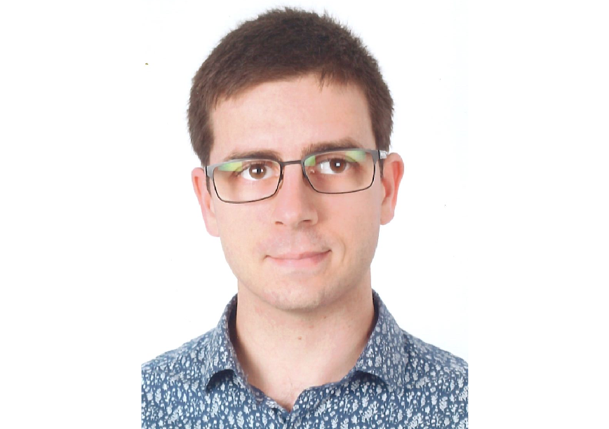
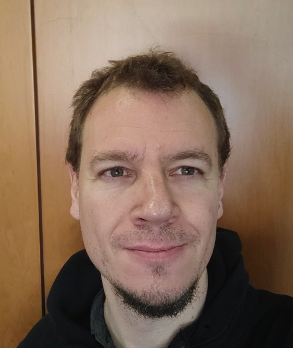
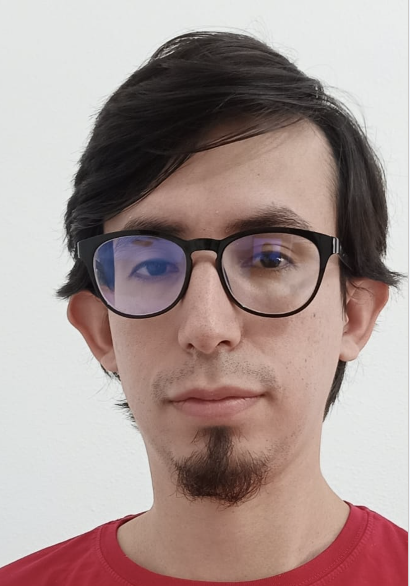
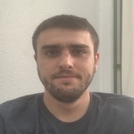
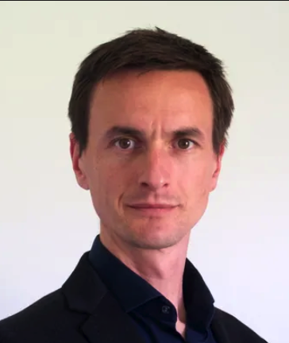
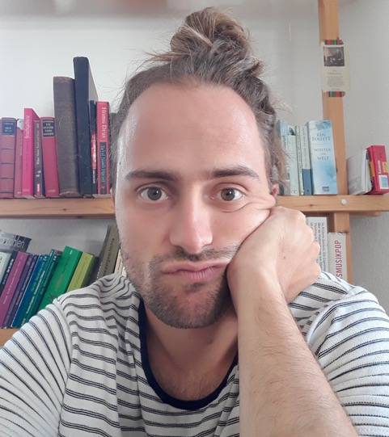
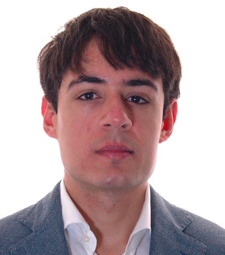
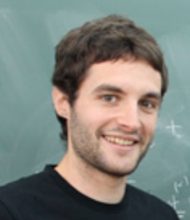
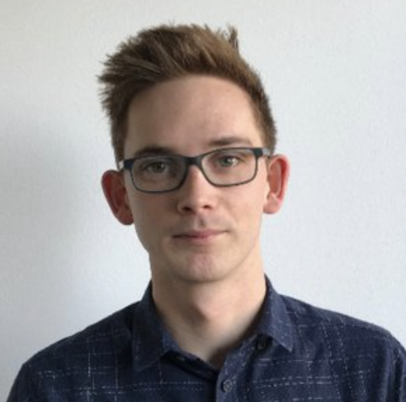

# The $\mathcal{C}\mathtt{osmo}\mathcal{L}\mathtt{attice}$ team

Everyone who develops CosmoLattice, with the modules they have worked on. If your question is about a specific topic, the badges show who to ask — tap a module to filter the list.

  

    Filter by module
    Showing <b data-count-shown>14</b> of <b data-count-total>14</b>
  

  

    <button type="button" class="cl-ppl-chip m-alp" data-mod="alp" aria-pressed="false">U(1) Axion</button>
    <button type="button" class="cl-ppl-chip m-nmc" data-mod="nmc" aria-pressed="false">NMC</button>
    <button type="button" class="cl-ppl-chip m-defects" data-mod="defects" aria-pressed="false">Defects</button>
    <button type="button" class="cl-ppl-chip m-gw" data-mod="gw" aria-pressed="false">Grav. Waves</button>
    <button type="button" class="cl-ppl-chip m-dims" data-mod="dims" aria-pressed="false">1D &amp; 2D</button>
    
    <button type="button" class="cl-ppl-chip cl-ppl-chip--struct" data-mod="core" aria-pressed="false">Core</button>
    <button type="button" class="cl-ppl-chip cl-ppl-chip--struct" data-mod="templat" aria-pressed="false">Templat</button>
    
    Upcoming
    <button type="button" class="cl-ppl-chip cl-ppl-chip--upcoming m-fluid" data-mod="fluid" aria-pressed="false">Fluid Dynamics</button>
    <button type="button" class="cl-ppl-chip cl-ppl-chip--upcoming m-su2axion" data-mod="su2axion" aria-pressed="false">SU(2) Axion</button>
    <button type="button" class="cl-ppl-clear" disabled>Clear</button>
  

<section class="cl-ppl-section">
<h2 class="cl-ppl-heading">Developers</h2>

  <article class="cl-ppl-card" data-mods="core templat defects gw">
    
    
Jorge Baeza-Ballesteros

    
DESY, Zeuthen, Germany

    

      <button type="button" class="cl-ppl-chip cl-ppl-chip--struct" data-mod="core" aria-pressed="false">Core</button>
      <button type="button" class="cl-ppl-chip cl-ppl-chip--struct" data-mod="templat" aria-pressed="false">Templat</button>
      <button type="button" class="cl-ppl-chip m-defects" data-mod="defects" aria-pressed="false">Defects</button>
      <button type="button" class="cl-ppl-chip m-gw" data-mod="gw" aria-pressed="false">Grav. Waves</button>
    

  </article>

  <article class="cl-ppl-card" data-mods="core alp nmc defects gw fluid">
    
    
<a href="https://webific.ific.uv.es/web/content/figueroa-daniel-g" target="_blank" rel="noopener noreferrer">Daniel G. Figueroa</a>

    
IFIC (CSIC-UV), Valencia, Spain

    
Creator of CosmoLattice

    

      <button type="button" class="cl-ppl-chip cl-ppl-chip--struct" data-mod="core" aria-pressed="false">Core</button>
      <button type="button" class="cl-ppl-chip m-alp" data-mod="alp" aria-pressed="false">U(1) Axion</button>
      <button type="button" class="cl-ppl-chip m-nmc" data-mod="nmc" aria-pressed="false">NMC</button>
      <button type="button" class="cl-ppl-chip m-defects" data-mod="defects" aria-pressed="false">Defects</button>
      <button type="button" class="cl-ppl-chip m-gw" data-mod="gw" aria-pressed="false">Grav. Waves</button>
      <button type="button" class="cl-ppl-chip cl-ppl-chip--upcoming m-fluid" data-mod="fluid" aria-pressed="false">Fluid Dynamics</button>
    

  </article>

  <article class="cl-ppl-card" data-mods="core templat alp nmc gw su2axion">
    
    
<a href="https://aflorio.science" target="_blank" rel="noopener noreferrer">Adrien Florio</a>

    
Bielefeld University, Germany

    
Creator of CosmoLattice

    

      <button type="button" class="cl-ppl-chip cl-ppl-chip--struct" data-mod="core" aria-pressed="false">Core</button>
      <button type="button" class="cl-ppl-chip cl-ppl-chip--struct" data-mod="templat" aria-pressed="false">Templat</button>
      <button type="button" class="cl-ppl-chip m-alp" data-mod="alp" aria-pressed="false">U(1) Axion</button>
      <button type="button" class="cl-ppl-chip m-nmc" data-mod="nmc" aria-pressed="false">NMC</button>
      <button type="button" class="cl-ppl-chip m-gw" data-mod="gw" aria-pressed="false">Grav. Waves</button>
      <button type="button" class="cl-ppl-chip cl-ppl-chip--upcoming m-su2axion" data-mod="su2axion" aria-pressed="false">SU(2) Axion</button>
    

  </article>

  <article class="cl-ppl-card" data-mods="core alp nmc gw">
    
    
Nicolas Loayza

    
CEICO, FZU, Prague, Czechia

    

      <button type="button" class="cl-ppl-chip cl-ppl-chip--struct" data-mod="core" aria-pressed="false">Core</button>
      <button type="button" class="cl-ppl-chip m-alp" data-mod="alp" aria-pressed="false">U(1) Axion</button>
      <button type="button" class="cl-ppl-chip m-nmc" data-mod="nmc" aria-pressed="false">NMC</button>
      <button type="button" class="cl-ppl-chip m-gw" data-mod="gw" aria-pressed="false">Grav. Waves</button>
    

  </article>

  <article class="cl-ppl-card" data-mods="core templat alp su2axion">
    
    
Franz R. Sattler

    
Bielefeld University, Germany

    

      <button type="button" class="cl-ppl-chip cl-ppl-chip--struct" data-mod="core" aria-pressed="false">Core</button>
      <button type="button" class="cl-ppl-chip cl-ppl-chip--struct" data-mod="templat" aria-pressed="false">Templat</button>
      <button type="button" class="cl-ppl-chip m-alp" data-mod="alp" aria-pressed="false">U(1) Axion</button>
      <button type="button" class="cl-ppl-chip cl-ppl-chip--upcoming m-su2axion" data-mod="su2axion" aria-pressed="false">SU(2) Axion</button>
    

  </article>

  <article class="cl-ppl-card" data-mods="core gw dims">
    
    
<a href="http://ftorrenti.github.io" target="_blank" rel="noopener noreferrer">Francisco Torrenti</a>

    
Univ. Carlos III de Madrid, Spain

    
Creator of CosmoLattice

    

      <button type="button" class="cl-ppl-chip cl-ppl-chip--struct" data-mod="core" aria-pressed="false">Core</button>
      <button type="button" class="cl-ppl-chip m-gw" data-mod="gw" aria-pressed="false">Grav. Waves</button>
      <button type="button" class="cl-ppl-chip m-dims" data-mod="dims" aria-pressed="false">1D &amp; 2D</button>
    

  </article>

  <article class="cl-ppl-card" data-mods="core alp">
    
    
Ander Urio

    
UPV/EHU, Bilbao, Spain

    

      <button type="button" class="cl-ppl-chip cl-ppl-chip--struct" data-mod="core" aria-pressed="false">Core</button>
      <button type="button" class="cl-ppl-chip m-alp" data-mod="alp" aria-pressed="false">U(1) Axion</button>
    

  </article>

  <article class="cl-ppl-card" data-mods="templat">
    
    
Wessel Valkenburg

    
Enjoying la vida loca out of academia

    
Creator of CosmoLattice

    

      <button type="button" class="cl-ppl-chip cl-ppl-chip--struct" data-mod="templat" aria-pressed="false">Templat</button>
    

  </article>

</section>

<section class="cl-ppl-section">
<h2 class="cl-ppl-heading">Upcoming Developers</h2>

  <article class="cl-ppl-card" data-mods="fluid">
    
    
Kenneth Marschall

    
IFIC, Valencia, Spain

    

      <button type="button" class="cl-ppl-chip cl-ppl-chip--upcoming m-fluid" data-mod="fluid" aria-pressed="false">Fluid Dynamics</button>
    

  </article>

  <article class="cl-ppl-card" data-mods="fluid">
    
    
Antonino S. Midiri

    
University of Geneva, Switzerland

    

      <button type="button" class="cl-ppl-chip cl-ppl-chip--upcoming m-fluid" data-mod="fluid" aria-pressed="false">Fluid Dynamics</button>
    

  </article>

  <article class="cl-ppl-card" data-mods="fluid">
    
    
Alberto Roper Pol

    
University of Geneva, Switzerland

    

      <button type="button" class="cl-ppl-chip cl-ppl-chip--upcoming m-fluid" data-mod="fluid" aria-pressed="false">Fluid Dynamics</button>
    

  </article>

</section>

<section class="cl-ppl-section">
<h2 class="cl-ppl-heading">Other Contributors</h2>

  <article class="cl-ppl-card" data-mods="alp">
    
    
Joanes Lizarraga

    
UPV/EHU, Bilbao, Spain

    

      <button type="button" class="cl-ppl-chip m-alp" data-mod="alp" aria-pressed="false">U(1) Axion</button>
    

  </article>

  <article class="cl-ppl-card" data-mods="nmc">
    
    
Toby Opferkuch

    
SISSA, Trieste, Italy

    

      <button type="button" class="cl-ppl-chip m-nmc" data-mod="nmc" aria-pressed="false">NMC</button>
    

  </article>

  <article class="cl-ppl-card" data-mods="nmc">
    
    
Ben A. Stefanek

    
King's College London, UK

    

      <button type="button" class="cl-ppl-chip m-nmc" data-mod="nmc" aria-pressed="false">NMC</button>
    

  </article>

</section>

